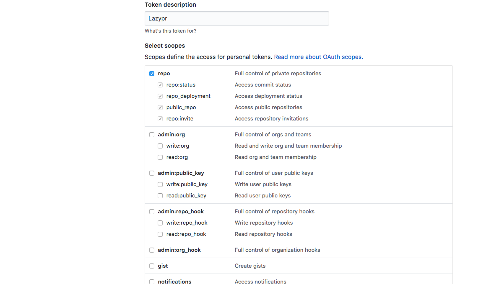

# LazyPr

Create a PR in Github from the terminal :)

## Installation

Add this line to your application's Gemfile:

```ruby
gem install lazypr
```

## Usage

```
lazypr [base branch name]
```
lazypr creates a PR to update the changes of the current branch to the base branch.

### Example

```
lazypr master
```
Let's say you are in the branch 'develop'. The above command creates a PR to update the changes of 'develop' in to 'master'

You can also enter the PR title by passing the second argument.
``` 
lazypr master "Update changes from develop"
```

### How lazypr authenticate your Github account

#### Github Personal Access Token

Lazypr allows you to authenticate your Github account using your personal access token.

Just set the following **ENV** variable in your **.bash_profile** or in your **.zshrc** file
```
export github_personal_access_token=xxxxxxxxxx
```
And don't forgot to source it. ``` source ./bash_profile``` or ``` source ./zshrc```

**Follow this [link](https://help.github.com/articles/creating-a-personal-access-token-for-the-command-line/) to setup your Github access token.**


**You need to add repo access to your access token. Refer the below screenshot.**



#### Using username and password

If Lazypr can't find the access_token then it prompts for your Github username and password


## Contributing

Bug reports and pull requests are welcome. This project is intended to be a safe, welcoming space for collaboration, and contributors are expected to adhere to the [Contributor Covenant](http://contributor-covenant.org) code of conduct.

## License

The gem is available as open source under the terms of the [MIT License](http://opensource.org/licenses/MIT).

